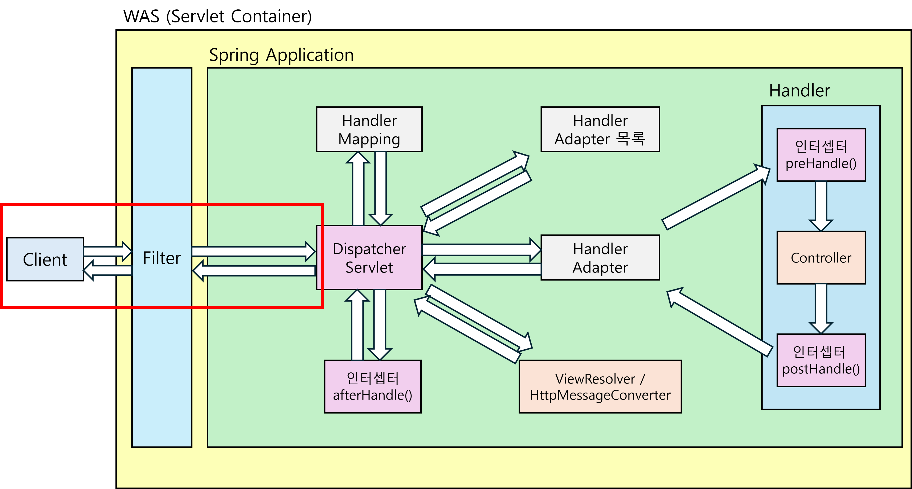
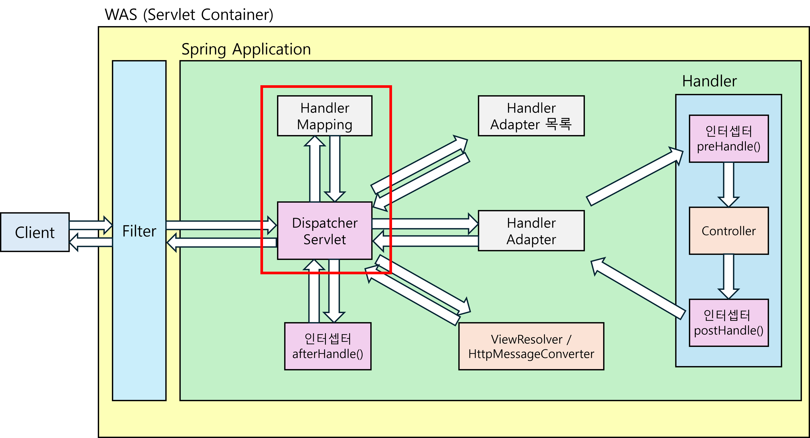
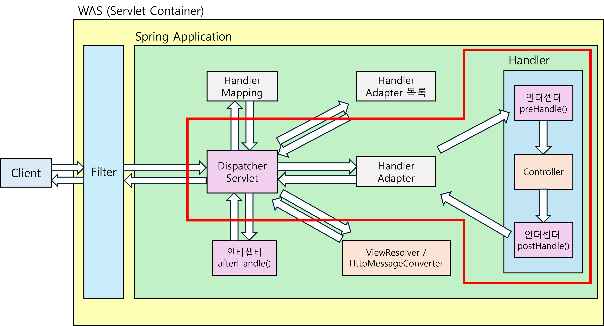
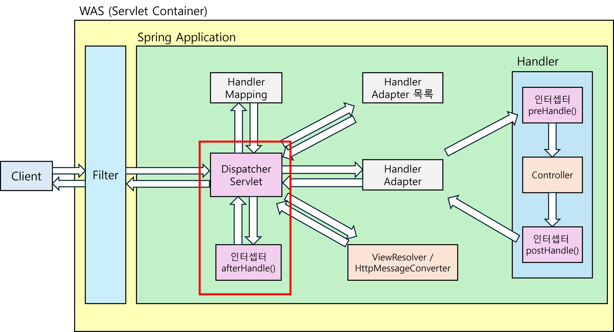

# 서블릿 vs. Spring MVC 비교

# **서블릿(Servlet) 기반 개발과 Spring MVC의 차이**

### **서블릿(Servlet)이란?**

- **동적인 요청을 처리하는 자바 웹 어플리케이션을 만들기 위한 프로그램**

기존의 서블릿 방식은 코드를 하나하나 작성해야 하는 불편함이 컸다.

`HttpServlet` 클래스를 **상속** 받아 `doGet()`, `doPost()` 같은 메소드를 가진 클래스를 **직접 작성**하고, **요청 URL 분석**, **파라미터 추출**, **HTML 응답을 생성**하는 모든 과정을 코드로 작성하고 구현해야 했다.

또한, 서블릿은 **하나의 HTTP 요청**을 받아 실행 되었기 때문에 **서블릿 여러 개**를 만들어 각 요청에 맞는 서블릿을 사용해야 했다. 이러한 방식은 서블릿에 **공통적으로 필요한 로직**을 **각 서블릿마다 작성**해야 하는 **문제점**이 있었다.

### Spring MVC

**Spring MVC**는 이러한 **공통 로직 처리 및 자동화**를 위해 **Front Controller 패턴(Dispatcher Servlet)**을 사용하는 방법을 택했다.

Spring MVC는 **DispatcherServlet**을 사용해 클라이언트의 **요청과 응답에 필요한 모든 작업을 자동화** 해준다.

더 자세히 서술하면,

1. 클라이언트에서 요청이 들어온다.
2. Filter를 거친 요청이 DispatcherServlet에 들어온다.
3. DispatcherServlet은 요청 URL을 분석하여 핸들러 어댑터 목록에서 알맞는 핸들러를 가져와 실행한다. 

핸들러가 실행되면,

1. 개발자가 작성한 Controller 및 비즈니스 로직 코드를 수행하고, 
2. 결과 데이터를 JSON 또는 HTML로 변환하여 클라이언트에 넘기는 과정이 수행된다. (응답)

이 과정이 Spring MVC에서 자동화되어 있기 때문에, 개발자는 핵심 비즈니스 로직에만 집중할 수 있게 된다.

- @Controller와 @RequestMapping
    
    @Controller는 이 클래스가 Controller 임을 지정하는 어노테이션이고,
    
    @RequestMapping은 들어온 요청을 어떤 메소드가 수행할지 매핑하는 어노테이션이다.
    
    즉, 핸들러가 실행되면 핸들러는 @Controller가 붙은 클래스를 찾고, 요청 URL과 매핑되는 @RequestMapping이 붙은 메소드를 찾아 실행시키는 것이다.
    

### Spring MVC가 왜 서블릿보다 편리한가?

**서블릿**은 매번 HTTP 요청 및 응답 관련 코드를 작성해야 했지만, **Spring MVC**에서는 **DispatcherServlet**을 사용해 클라이언트의 **HTTP 요청 및 응답을 자동화**했다.

**프레임워크**라는 것은 어플리케이션을 보다 효율적으로 개발할 수 있도록 하는 것이 주요 목적이다.

프레임워크가 어플리케이션의 뼈대 역할을 해줌으로써, 개발자는 반복적인 작업을 최소화하고, 핵심 비즈니스 로직에 집중할 수 있게 되어 **개발 생산성**과 **확장성**을 높일 수 있다.

만약 서블릿으로 계속 개발했다면, HTTP 요청 및 응답 관련 코드를 항상 작성해야하는 불편함과 동시에, 오류가 발생했을 때, HTTP 요청 및 응답 관련 코드의 문제인지 매번 확인해야 할 것이다.

---

## **DispatcherServlet** 동작원리 다이어그램

전체 다이어그램

### 단계별 설명

1. 클라이언트에서의 요청이 필터를 거쳐 디스패처 서블릿으로 들어온다.

2. 디스패처 서블릿은 요청 URL을 보고 핸들러 매핑을 통해 핸들러를 선택한다.

3. 핸들러를 실행할 수 있는 핸들러 어댑터를 조회한다.

4. 핸들러 어댑터를 통해 핸들러가 실행된다.

핸들러가 실행되면, 

1. preHandle() 인터셉터가 먼저 실행되고
2. Controller가 실행되어 비즈니스 로직이 작동된다.
3. Controller 실행이 끝나면 postHandle() 인터셉터가 실행된다.
4. 디스패처 서블릿에 결과를 반환한다.

5. ViewResolver 또는 HttpMessageConverter 호출

반환받은 결과를

`@Controller` 라면 **ViewResolver**를 실행하여 **HTML** 형태로 만들고,

`@RestController`로 REST 형식이라면 **HttpMessageConverter**를 실행하여 **JSON** 형태로 만든다.

6. 마지막 afterHandle() 인터셉트 실행하고, 클라이언트에게 응답을 전송한다.

만약 `@Controller`로 **SSR(Server Side Rendering, 서버에서 결과 HTML 생성)**이라면, 이 시점에서 **View 렌더링**이 실행되고 **afterHandle() 인터셉터**가 실행된다.

REST 형식이라면 **View 렌더링**이 실행되지 않고, **afterHandle() 인터셉터**만 실행된다.