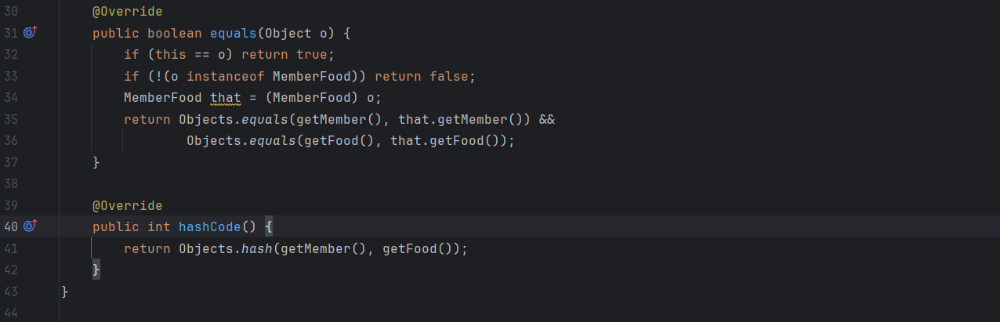

# 성능을 고려한 연관관계 매핑 & 최적화 적용

# @OneToMany List와 Set

## List

- 중복을 허용하고, 순서가 중요할 때

List에서 요소를 삭제할 때, 매핑된 DB 테이블에서는 **모든 요소를 delete**하고, **삭제된 요소를 제외한 나머지 요소**를 **다시 insert**하는 쿼리 구조로 삭제가 진행된다.

**하나의 delete 쿼리만으로 데이터를 삭제할 수 없는 이유**는, **Hibernate**는 List에서 삭제되어야 하는 요소가 **정확히 어떤 것인지 판별할 수 없기 때문**이다.

List는 중복을 허용한다.

예를 들어, id는 서로 다르지만 **내용은 완전히 같은 두 개의 객체**가 List에 있을 수 있다.

이 중 하나를 삭제했을 때, Hibernate는 **DB에 있는 여러 개의 동일한 내용의 데이터** 중 **정확히 어떤 id를 가진 행(row)을 삭제해야 할지 특정할 수 없다.**

Hibernate는 이러한 모호함을 피하기 위해, 가장 안전한 방법인 **'전체 삭제 후 재삽입'** 방식으로 List의 삭제를 처리한다.

다만, List에 `@OrderColumn`을 사용한다면 **하나의 delete 쿼리만으로 데이터를 삭제**할 수 있다. 

`@OrderColumn`은 DB 테이블에 List 요소의 인덱스를 새로운 칼럼으로 추가한다.

이렇게 되면 Hibernate는 이 칼럼을 보고 특정 요소 delete를 수행할 수 있게 된다.

## Set

- 중복을 허용하지 않고, 순서 상관없을 때

또 다른 방법으로 List 대신 **Set을 사용**하는 방법이 있다.

Set은 순서가 없고, 중복을 허용하지 않는다.

중복을 허용하지 않기 때문에 Hibernate는 **특정 요소를 명확히 식별**해 낼 수 있고 **하나의 특정 요소 delete를 수행**할 수 있게 된다.

하지만 Set을 사용할 때는 어떤 필드를 기준으로 중복 여부를 판단할지 `equals()`와 `hashCode()` 메소드를 **오버라이딩**하여 구현해야 한다는 단점 및 번거로움이 있다.

### List → Set 변경 코드 중 일부

Member 클래스

MemberFood 클래스

Set에서 중복을 판별하는 기준을 정해야 한다.

기본 `equals()`와 `hashCode()`는 메모리를 기준으로 데이터가 같은지 다른지 판별한다.

특정 필드(주로 FK)를 기준으로 판별이 가능하도록 `equals()`와 `hashCode()` 메소드를 재정의한다.

---

# orphanRemoval = true 옵션

**고아객체 제거 옵션**

부모 엔티티와 자식 엔티티의 관계에서, 자식 엔티티가 부모 엔티티의 컬렉션에서 제거되어 고아객체가 되면 DB에서도 해당 자식 데이터가 자동으로 삭제되도록 만드는 옵션이다.

부모 엔티티를 통해 자식 객체의 생명주기를 관리할 수 있다.

### `cascade = CascadeType.REMOVE` 와의 차이점

- `cascade = CascadeType.REMOVE`
    - 부모 객체가 삭제될 때 자식도 삭제(delete)
- `orphanRemoval = true`
    - 부모 객체에는 변경이 없고 자식만 삭제될 때 자식을 완전히 삭제

예를 들어,

`cascade = CascadeType.REMOVE`는 사용자가 회원 탈퇴할 시 연관 데이터 삭제한다.

`orphanRemoval = true`는 사용자가 약관을 취소하면 해당 MemberTerm 데이터(row)를 삭제한다.

`orphanRemoval = false` 일 경우 사용자가 약관을 취소하면 해당 데이터(row)의 FK가 `null`로만 변경되고 delete되지는 않는다.

### 적용 코드

Member 클래스

MemberFood, MemberTerm, MemberMission에는 `orphanRemoval = true` 적용

Review는 Store와도 연관되어 있고, 데이터 보존 목적으로 `orphanRemoval = true`를 적용하지 않음

Store 클래스

Review 클래스