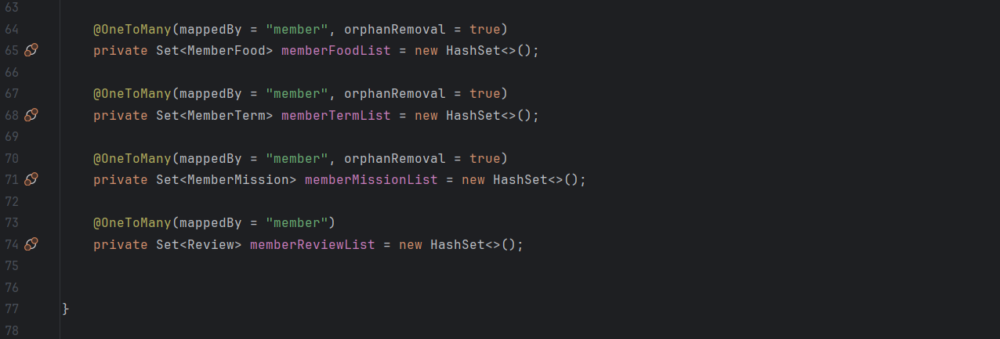
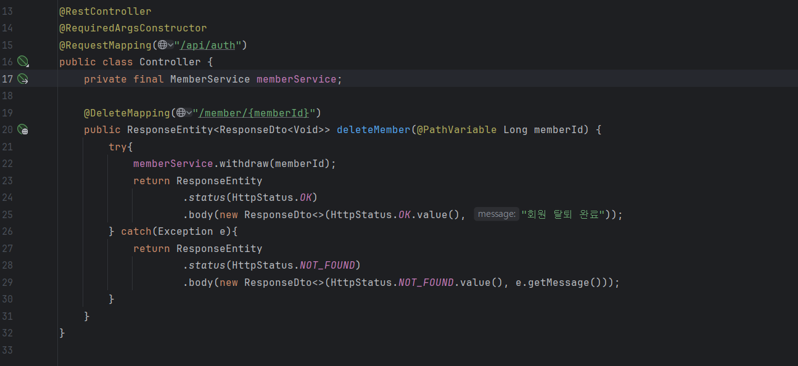
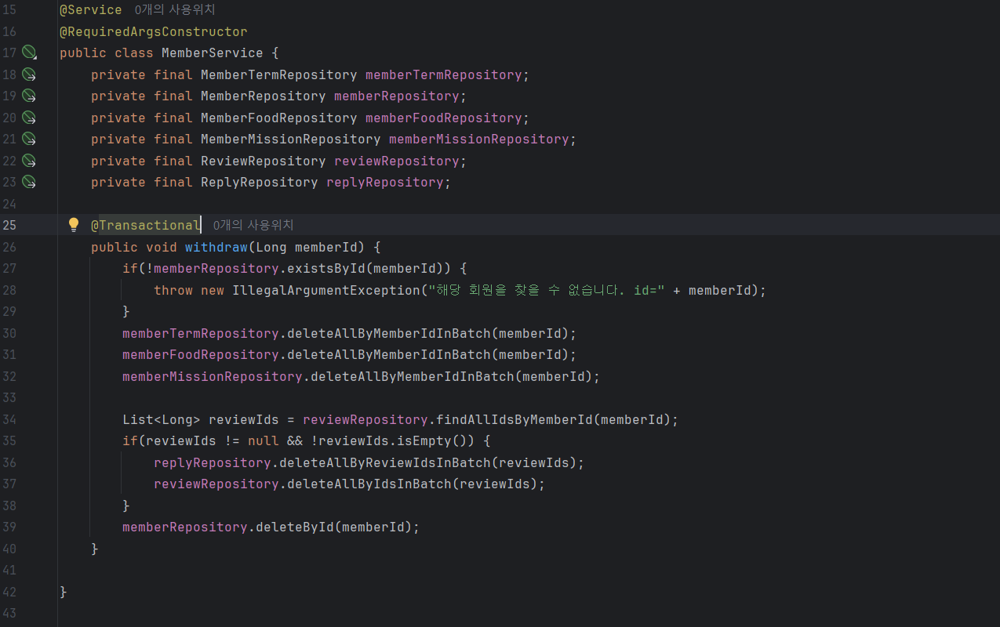
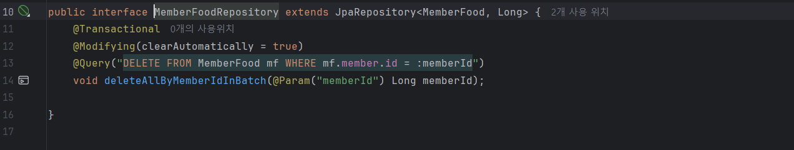
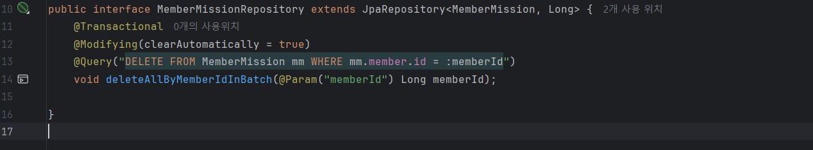
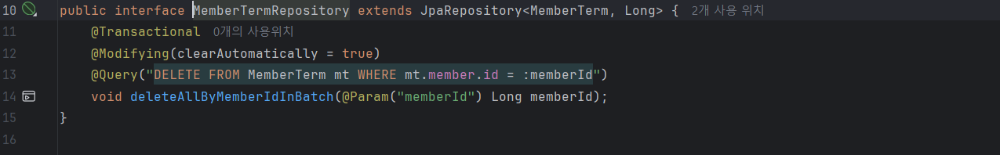
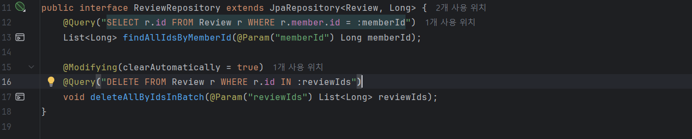
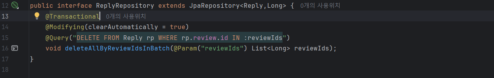

# 트랜잭션 & 동시성 이슈 처리

# 회원이 탈퇴할 경우 **관련된 모든 데이터를 삭제하는 API**

### @Modifying

- `@Modifying`은 `@Query`에서 UPDATE나 DELETE를 수행할 때 사용
- `@Query`는 조회가 목적이기 때문에 `@Modifying`을 붙여서 이 작업이 데이터를 수정하는 작업임을 명시

데이터를 변경하는 작업은 트랙잭션 내에서 이뤄져야 하기 때문에 `@Transactional`을 같이 붙여줘야 한다.

### Batch Delete

여러 개의 데이터를 한 번의 쿼리로 삭제하는 작업

기존의 `cascade`는 여러 개의 Delete쿼리를 생성하는 방식으로 작동했다. Batch Delete는 하나의 쿼리로 연관된 여러 데이터를 삭제한다.

### **코드**



Member

Batch Delete는 연관된 모든 데이터를 삭제하는 코드를 직접 작성해야 한다.

따라서 `cascade = CascadeType.*REMOVE*` 설정을 삭제하고 진행한다.



Controller



Service



MemberFoodRepository



MemberMissionRepository



MemberTermRepository



ReviewRepository



ReplyRepository

---

# DB 동시성 문제

**여러 개의 트랜잭션이 동시에 같은 데이터에 접근하여 작업을 수행할 때 발생할 수 있는 데이터의 일관성 및 무결성을 파괴하는 문제**

## 락킹

**동시성 문제를 해결하기 위한 방법**

트랜잭션에 락(Lock)을 걸어서 다른 트랜잭션이 이미 접근 중인 데이터를 사용하지 못하게 한다.

## 락킹 전략

### 비관적 락(Pessimistic Lock)

**데이터 충돌이 빈번하게 일어날 것이라고 비관적으로 가정**

트랜잭션이 데이터에 접근하는 시점부터 미리 락을 걸어 다른 트랜잭션의 접근을 막는 동시성 제어 방식

**동작 방식**

- 트랜잭션이 특정 데이터(Row)를 읽거나 수정하려 할 때 락을 걸고, Commit 또는 Rollback이 되어 종료되면 잠금을 해제함.

**장점**

- 데이터를 선점하고 작업하므로 데이터가 동시에 수정되는 문제를 원천적으로 차단

**단점**

- **성능 저하**: 락을 획득한 트랜잭션이 작업을 마칠 때까지 다른 트랜잭션은 대기해야 한다.
- **데드락**: 두 개 이상의 트랜잭션이 서로 상대방의 락이 해제되기를 기다리면서 무한정 대기상태에 빠질 수 있다.

**사용 환경**

- 충돌이 자주 발생할 것으로 예상되는 환경에서
    - Ex) 티켓 에매, 재고 관리, 선착순 이벤트
- 데이터 정합성이 매우 중요한 경우
    - Ex) 계좌 이체, 결제 처리
- 트랜잭션 처리 시간이 짧아서 대기 시간을 최소화할 수 있을 때 사용

비관적 락은 성능 손해를 감수하더라도 **데이터의 정합성을 확실하게 지켜야 할 때** 사용하는 것이 좋다.

### 낙관적 락(Optimistic Lock)

**데이터 충돌이 거의 일어나지 않을 것이라고 낙관적으로 가정**

데이터를 잠그지 않은 상태에서 작업을 시작하는 동시성 제어 방식

**동작방식**

- 데이터에 버전 번호를 부여하여 데이터의 변경 여부를 확인하는 방식
    1. DB 테이블에 version 칼럼을 추가
    2. 트랜잭션이 데이터를 읽을 때 현재 버전 정보(version = 1)를 읽음
    3. 트랜잭션이 작업을 마치고 데이터를 수정하려 할 때, 처음 가져온 version과 현재 DB 테이블의 version이 같은지 확인
        1. version이 동일하면 version을 +1 하고 종료
        2. 다른 트랜잭션이 먼저 수정해서 version이 2로 변경되었다면 업데이트가 실패되고 예외를 발생

**장점**

- **높은 성능 및 동시성**: 데이터를 잠그지 않으므로 트랜잭션 간의 대기 시간이 없다.
- **데드락 없음**

**단점**

- **복잡한 구현**: 업데이트 실패 시 재시도 로직을 개발자가 직접 구현해야 한다.
- **잦은 충돌 시 성능 저하**: 충돌이 빈번하게 발생한다면 오히려 시스템에 더 큰 부하를 줄 수 있다.

**사용 환경**

- 충돌이 거의 발생하지 않을 것으로 예상되는 환경에서
    - (예: 게시판 글 조회 및 수정, 상품 정보 조회 등)
- 사용자에게 재시도를 유도해도 괜찮은 서비스에서

낙관적 락은 데이터 정합성을 보장하면서도 **락으로 인한 성능 저하를 피하고 싶을 때** 사용한다.

## @Lock

- JPA에서 비관적 락을 수행하는 방법
- Repository의 메소드에 `@Lock`을 붙여서 비관적 락을 수행

### `LockModeType` 속성

**PESSIMISTIC_WRITE**

- **배타적 잠금 (Exclusive Lock)**
- 한 트랜잭션이 데이터에 쓰기 락을 걸면, 다른 트랜잭션은 해당 데이터를 **읽는 것과 쓰는 것 모두 불가능**하며 락이 해제될 때까지 기다려야 한다.

**PESSIMISTIC_READ**

- **공유 잠금 (Shared Lock)**
- 한 트랜잭션이 읽기 락을 걸면, 다른 트랜잭션도 데이터를 **읽을 수는 있지만, 수정(쓰기)은 불가능**하다.

### **사용 예시**

```java
public interface MissionRepository extends JpaRepository<Mission, Long> {
    @Lock(LockModeType.PESSIMISTIC_WRITE)
    Optional<Mission> findById(Long missionId);
}
```

## @Version

JPA에서 낙관적 락을 수행하는 방법

Entity의 필드에 `@Version`을 붙여서 낙관적 락을 수행

### **사용 예시**

```java
@Entity
public class Store {    
    @Id
    @GeneratedValue(strategy = GenerationType.IDENTITY)
    private Long id;
    
    // 낙관적 락을 위한 버전 필드
    @Version
    private Long version;
}
```

---

# 동시성 문제가 발생할 수 있는 시나리오

1. **같은 사용자가 미션 도전을 여러 번 눌러서 같은 요청이 두 번 이상 들어가는 경우**
    - **비관적 락**으로 같은 요청이 들어가도 제대로 처리될 수 있도록 함
    - `MissionRepository`의 미션 도전 메소드에 `@Lock`을 사용

1. **여러 사용자가 리뷰로 별점을 남길 때 트랙잭션이 겹쳐서 별점 집계가 제대로 되지 않은 경우**
    - 낙관적 락으로 데이터 정합성을 지킴
    - `Review` Entity 클래스에 `@Version`을 사용하는 `version` 필드 추가