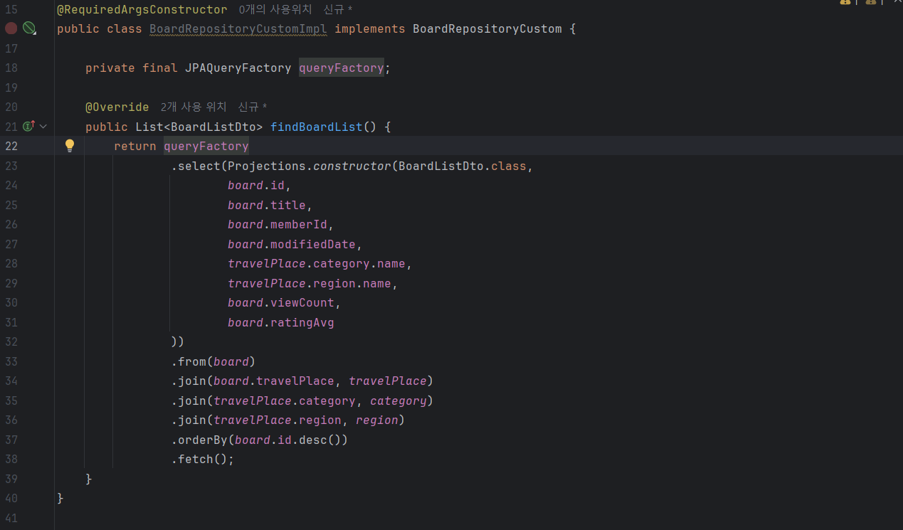
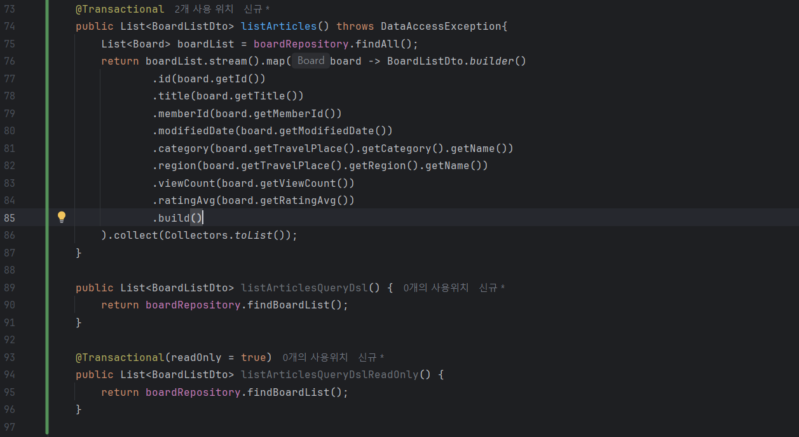

# 과거 프로젝트 성능 병목 파악 및 최적화

- **`spring.jpa.show-sql=true` & `logging.level.org.hibernate.SQL=DEBUG` 실행된 SQL 로그 분석**
    
    ```
    2025-10-10T21:28:32.717+09:00 DEBUG 17804 --- [board] [nio-8081-exec-2] org.hibernate.SQL                        : 
        select
            b1_0.id,
            b1_0.comment_count,
            b1_0.content,
            b1_0.favorite_count,
            b1_0.member_id,
            b1_0.modified_date,
            b1_0.rating_avg,
            b1_0.reg_date,
            b1_0.title,
            b1_0.travel_place_id,
            b1_0.view_count 
        from
            board b1_0
    
    ```
    
    ```
    2025-10-10T21:28:32.720+09:00 DEBUG 17804 --- [board] [nio-8081-exec-2] org.hibernate.SQL                        : 
        select
            tp1_0.id,
            tp1_0.address,
            c1_0.id,
            c1_0.name,
            tp1_0.name,
            r1_0.id,
            r1_0.name 
        from
            travel_place tp1_0 
        left join
            category c1_0 
                on c1_0.id=tp1_0.category_id 
        left join
            region r1_0 
                on r1_0.id=tp1_0.region_id 
        where
            tp1_0.id=?
    Hibernate: 
        select
            tp1_0.id,
            tp1_0.address,
            c1_0.id,
            c1_0.name,
            tp1_0.name,
            r1_0.id,
            r1_0.name 
        from
            travel_place tp1_0 
        left join
            category c1_0 
                on c1_0.id=tp1_0.category_id 
        left join
            region r1_0 
                on r1_0.id=tp1_0.region_id 
        where
            tp1_0.id=?
    
    ```
    
    Board(게시판)에서 TravelPlace(여행지)를 조회할 때 **N+1 문제 발생**
    
    원인
    
    - Board와 TravelPlace를 `@OneToOne` 관계로 설정했지만, FetchJoin이나 BatchSize 등의 처리를 안함
    
    ---
    
- **QueryDSL 기반 최적화**
    
    ## QueryDSL 적용
    
    
    
    QueryDSL기반 Select 메소드
    
    
    
    실행 속도 비교를 위한 게시글 조회 메소드 3개
    
    ### 테스트 환경
    
    - 테스트 데이터(게시물) 개수: 17개
    
    ### 테스트 코드 및 시나리오
    
    **시나리오 A:** QueryDSL 적용 이전 기존 N+1 발생 코드
    
    **시나리오 B:** QueryDSL 적용 및 `@Transactional(readOnly=true)` 미적용 코드
    
    **시나리오 C:** QueryDSL 적용 및 `@Transactional(readOnly=true)` 적용 코드
    
    ```java
    package com.traveler.board;
    
    import com.traveler.board.service.BoardService;
    import org.junit.jupiter.api.Test;
    import org.springframework.beans.factory.annotation.Autowired;
    import org.springframework.boot.test.context.SpringBootTest;
    
    @SpringBootTest
    class BoardApplicationTests {
        @Autowired
        private BoardService boardService;
    
        @Test
        void performanceComparisonTest() {
            // 1. StopWatch 객체 생성
            StopWatch stopWatch = new StopWatch("게시글 목록 조회 성능 비교");
    
            // 2. 시나리오 A 측정
            stopWatch.start("A: 최적화 이전 (N+1)");
            boardService.listArticles();
            stopWatch.stop();
    
            // 3. 시나리오 B 측정
            stopWatch.start("B: QueryDSL만 적용");
            boardService.listArticlesQueryDsl();
            stopWatch.stop();
    
            // 4. 시나리오 C 측정
            stopWatch.start("C: QueryDSL + readOnly=true");
            boardService.listArticlesQueryDslReadOnly();
            stopWatch.stop();
    
            // 5. 측정 결과 리포트 출력
            System.out.println(stopWatch.prettyPrint());
        }
    }
    ```
    
    
    
    실행 속도 측정 테스트 결과
    
    ### 테스트 결과
    
    최적화 이전의 N+1 문제가 발생한 **시나리오 A**가 **245.2ms**로 가장 느리고,
    
    QueryDSL과 `@Transactional(readOnly=true)` 을 함께 적용한 **시나리오 C**가 **9.5ms**로 가장 빠르게 측정 됨.
    
    ---
    
- **BatchSize 조절을 통한 성능 비교**
    
    # 성능 비교 방법
    
    1. 실행된 SQL 쿼리 개수 측정
    2. 실행 속도 측정
    
    # 실행된 SQL 쿼리 개수 측정 테스트
    
    - 테스트 데이터(게시물) 개수: 217개
    - 테스트 순서
        - @BatchSize 미적용
        - @BatchSize 적용
        - @BatchSize 미적용 및 FetchJoin 적용
    
    ### **@BatchSize 미적용**
    
    ```java
    package com.traveler.board;
    
    import com.traveler.board.service.BoardService;
    import jakarta.persistence.EntityManager;
    import org.hibernate.Session;
    import org.hibernate.stat.Statistics;
    import org.junit.jupiter.api.BeforeEach;
    import org.junit.jupiter.api.Test;
    import org.springframework.beans.factory.annotation.Autowired;
    import org.springframework.boot.test.context.SpringBootTest;
    
    @SpringBootTest
    class BoardApplicationTests {
        @Autowired
        private BoardService boardService;
    
        @Autowired
        private EntityManager em;
    
        private Statistics statistics;
    
        @BeforeEach
        void setUp() {
            //Statistics 객체 가져오기
            statistics = em.unwrap(Session.class).getSessionFactory().getStatistics();
            statistics.clear(); // 이전 테스트의 통계 기록 초기화
        }
    
        @Test
        void countQueriesWithoutBatchSizeTest() {
            System.out.println("--- @BatchSize 미적용 테스트 시작 ---");
          
            long beforeQueryCount = statistics.getPrepareStatementCount();
    
            boardService.listArticles();
    
            long afterQueryCount = statistics.getPrepareStatementCount();
    
            System.out.println("실행된 쿼리 수: " + (afterQueryCount - beforeQueryCount));
            System.out.println("------------------------------------");
        }
    }
    
    ```
    
    
    
    BatchSize 미적용 테스트 결과
    
    ### **@BatchSize 적용**
    
    ```java
    package com.traveler.board;
    
    import com.traveler.board.service.BoardService;
    import jakarta.persistence.EntityManager;
    import org.hibernate.Session;
    import org.hibernate.stat.Statistics;
    import org.junit.jupiter.api.BeforeEach;
    import org.junit.jupiter.api.Test;
    import org.springframework.beans.factory.annotation.Autowired;
    import org.springframework.boot.test.context.SpringBootTest;
    
    @SpringBootTest
    class BoardApplicationTests {
        @Autowired
        private BoardService boardService;
    
        @Autowired
        private EntityManager em;
    
        private Statistics statistics;
    
        @BeforeEach
        void setUp() {
            //Statistics 객체 가져오기
            statistics = em.unwrap(Session.class).getSessionFactory().getStatistics();
            statistics.clear(); // 이전 테스트의 통계 기록 초기화
    
        }
    
        @Test
        void countQueriesWithoutBatchSizeTest() {
            System.out.println("--- @BatchSize(size=100) 적용 테스트 시작 ---");
    
            // 주의: 이 테스트를 위해서는 TravelPlace 엔티티의 @BatchSize를 잠시 주석 처리해야 합니다.
    
            long beforeQueryCount = statistics.getPrepareStatementCount();
    
            boardService.listArticles(); // N+1 유발 메서드 호출
    
            long afterQueryCount = statistics.getPrepareStatementCount();
    
            System.out.println("실행된 쿼리 수: " + (afterQueryCount - beforeQueryCount));
            System.out.println("------------------------------------");
        }
    
    }
    
    ```
    
    
    
    BatchSize 적용 테스트 결과
    
    ### **@BatchSize 미적용, FetchJoin 적용**
    
    ```java
    package com.traveler.board;
    
    import com.traveler.board.service.BoardService;
    import jakarta.persistence.EntityManager;
    import org.hibernate.Session;
    import org.hibernate.stat.Statistics;
    import org.junit.jupiter.api.BeforeEach;
    import org.junit.jupiter.api.Test;
    import org.springframework.beans.factory.annotation.Autowired;
    import org.springframework.boot.test.context.SpringBootTest;
    
    @SpringBootTest
    class BoardApplicationTests {
        @Autowired
        private BoardService boardService;
    
        @Autowired
        private EntityManager em;
    
        private Statistics statistics;
    
        @BeforeEach
        void setUp() {
            //Statistics 객체 가져오기
            statistics = em.unwrap(Session.class).getSessionFactory().getStatistics();
            statistics.clear(); // 이전 테스트의 통계 기록 초기화
    
        }
    
        @Test
        void countQueriesWithoutBatchSizeTest() {
            System.out.println("--- Fetch Join 적용 테스트 시작 ---");
    
            long beforeQueryCount = statistics.getPrepareStatementCount();
    
            boardService.listArticlesFetchJoin();
    
            long afterQueryCount = statistics.getPrepareStatementCount();
    
            System.out.println("실행된 쿼리 수: " + (afterQueryCount - beforeQueryCount));
            System.out.println("------------------------------------");
        }
    
    }
    
    ```
    
    
    
    FetchJoin 적용 테스트 결과
    
    ## 실행된 SQL 쿼리 개수 측정 테스트 결과
    
    @BatchSize 미적용: **217개** 쿼리 실행
    
    @BatchSize(size=100) 적용: **6개** 쿼리 실행
    
    @BatchSize 미적용, FetchJoin 적용: **1개** 쿼리 실행
    
    ---
    
    # 실행 속도 측정 테스트
    
    - 테스트 데이터(게시물) 개수: 217개
    - 테스트 순서
        - @BatchSize 적용
        - @BatchSize 미적용, FetchJoin 적용
    
    ### @BatchSize 적용
    
    ```java
    package com.traveler.board;
    
    import com.traveler.board.service.BoardService;
    import org.junit.jupiter.api.Test;
    import org.springframework.beans.factory.annotation.Autowired;
    import org.springframework.boot.test.context.SpringBootTest;
    import org.springframework.util.StopWatch;
    
    @SpringBootTest
    class BoardApplicationTests {
        @Autowired
        private BoardService boardService;    
    
        @Test
        void performanceComparisonTest() {
            StopWatch stopWatch = new StopWatch("게시글 목록 조회 성능 비교");
            
            stopWatch.start("A: BatchSize 적용");
            boardService.listArticles();
            stopWatch.stop();
    
            System.out.println(stopWatch.prettyPrint());
        }
    }
    
    ```
    
    
    
    BatchSize 실행 속도 테스트 결과
    
    ### @BatchSize 미적용, FetchJoin 적용
    
    ```java
    package com.traveler.board;
    
    import com.traveler.board.service.BoardService;
    import org.junit.jupiter.api.Test;
    import org.springframework.beans.factory.annotation.Autowired;
    import org.springframework.boot.test.context.SpringBootTest;
    import org.springframework.util.StopWatch;
    
    @SpringBootTest
    class BoardApplicationTests {
        @Autowired
        private BoardService boardService;
    
        @Test
        void performanceComparisonTest() {
            StopWatch stopWatch = new StopWatch("게시글 목록 조회 성능 비교");
            
            stopWatch.start("B: FetchJoin 적용");
            boardService.listArticlesFetchJoin();
            stopWatch.stop();
    
            System.out.println(stopWatch.prettyPrint());
        }
    }
    
    ```
    
    
    
    FetchJoin 실행 속도 테스트 결과
    
    ## 실행 속도 테스트 결과
    
    - @BatchSize 적용: 284.7ms
    - @BatchSize 미적용, FetchJoin 적용: 188.8ms
    
    ## 결론
    
    FetchJoin이 @BatchSize보다 실행되는 쿼리 개수도 적고, 실행 속도도 빠르다.
    
    FetchJoin이 @BatchSize보다 성능이 더 뛰어나다.
    
    ---
    
- **최적화 적용 후, 성능 향상 결과 정리**
    
    FetchJoin이 BatchSize보다 성능이 더 뛰어나지만, FetchJoin은 몇 가지 문제점이 발생할 수 있다.
    
    대표적으로 데이터 뻥튀기 문제, 페이징 처리의 어려움 등이 있다.
    
    # JPA 성능 최적화
    
    ## FetchJoin
    
    `@OneToMany`, `@ManyToMany` 등 ~ToMany 관계에서 FetchJoin을 사용하면 **데이터 뻥튀기 문제**가 발생한다.
    
    데이터 뻥튀기 문제는 FetchJoin으로 인해 **카르테시안 곱**이 발생하여 데이터 행의 개수가 매우 많아지는 문제를 말한다.
    
    예를 들면,
    
    게시글(Post) 2개에 댓글(Comment)이 10개 달려있을 경우, Post와 Comment를 조인하면 20개의 row가 만들어진다.
    
    | post_id | post_title | comment_id | comment_content |
    | --- | --- | --- | --- |
    | 1 | 제목1 | 101 | 댓글 내용1 |
    | 1 | 제목1 | 102 | 댓글 내용2 |
    | 1 | 제목1 | 103 | 댓글 내용3 |
    | ... | ... | ... | ... |
    | 2 | 제목2 | 120 | 댓글 내용20 |
    
    이 뻥튀기된 데이터를 메모리로 가져오기 때문에 문제가 발생한다.
    
    데이터 뻥튀기는 **많은 메모리를 사용**한다는 근본적인 문제와 **모든 데이터를 메모리로 가져와서 이후 정렬과 페이징을 수행**하게 된다는 문제가 있다.
    
    사실상 페이징처리가 의미가 없어지는 것이다.
    
    위의 문제는 ~ToMany 관계에서 발생하는 문제점이다.
    
    `@ManyToOne`, `@OneToOne`과 같은 ~ToOne 관계에서는 데이터 뻥튀기 문제가 발생하지 않는다.
    
    즉, ~ToOne 관계에서는 FetchJoin을 사용해도 괜찮다.
    
    - **이 외의 문제 및 주의사항**
        - FetchJoin 대상에 별칭을 줄 수 없다.
        - WHERE절은 FetchJoin 대상에게는 사용하면 안된다.
        - 둘 이상의 컬렉션은 FetchJoin 할 수 없다.
    
    ---
    
    그렇다면, ~ToMany 관계의 컬렉션에서는 어떻게 페이지네이션과 정렬을 적용해야 할까?
    
    ## BatchSize
    
    BatchSize는 가져올 프록시 객체를 설정한 size만큼 IN 쿼리로 조회한다.
    
    ```sql
    SELECT m.* FROM member m WHERE [m.id](http://m.id/) IN (1, 2, ... ,10)
    ```
    
    즉, ~ToMany 관계에서는 FetchJoin을 사용하지 않고, @BatchSize를 사용하여 N+1 문제를 해결한다.
    
    ### **주의사항**
    
    **Member -> MemberFood -> Food 조회 시**
    
    Member를 이용해 MemberFood를 BatchSize 설정하여 조회한 뒤, MemberFood를 이용해 Food를 조회할 경우
    
    Food 엔티티에도 BatchSize를 적용해줘야 N+1문제가 발생하지 않는다.
    
    즉, 연관 관계가 여러 단계인 경우 각 지연 로딩이 발생하는 지점마다 @BatchSize를 적용해줘야 한다.
    
    혹은
    
    **Member -> MemberFood**는 **BatchSize로 조회**하고,
    
    **MemberFood -> Food**는 **FetchJoin으로 조회**하는 방법이 있다. **(커스텀 쿼리 메서드)**
    
    MemberFood -> Food는 다대일 관계이기 때문에 FetchJoin을 사용해도 문제되지 않는다.
    
    그러므로 MemberFood로 Food를 조회할 때는 FetchJoin을 사용하여 조회하도록 하는 방법도 있다.
    
    ---
    
    ## 필요한 컬럼만 조회하는 기능: DTO Projection
    
    **쿼리 단계에서 필요한 컬럼만 선택적으로 조회하는 방식**
    
    일반적인 JPA 조회 방식은 
    
    ```sql
    SELECT m.* FROM member m WHERE m.id=1; 
    ```
    
    위 쿼리와 같이 모든 칼럼을 메모리에 가져온 뒤, 원하는 칼럼만 사용한다.
    
    이 경우 필요하지 않은 칼럼이 같이 조회되기 때문에 칼럼의 개수가 많다면 성능 상에 문제가 발생할 수 있다.
    
    DTO Projection 방식은
    
    ```sql
    SELECT [m.id](http://m.id/), [m.name](http://m.name/) FROM member m WHERE m.id=1; 
    ```
    
    위 쿼리와 같이 필요한 칼럼만 가져오고, 바로 DTO에 매핑할 수 있어 불필요한 데이터 조회와 매핑 부담을 줄일 수 있다.
    
    처음 쿼리에서 필요한 칼럼만 조회하여 메모리에 올리는 방식이기 때문에 N+1 문제도 발생하지 않는다.
    
    다만,
    
    **DB 단계에서 Join을 수행**하고 **필요한 칼럼만 가져오는 것**이기에, 카르테시안 곱으로 인해 **중복되는 칼럼이 그대로 반환될 수 있다.**
    
    이 경우 애플리케이션 단계에서 `groupingBy`로 컬렉션처럼 묶어줘야 한다.
    
    즉, DB에서 가져온 데이터를 가공하는 추가적인 단계가 필요하다.
    
    ---
    
    ### **결론**
    
    **무조건 하나의 방식을 사용하는 것이 아니라, 상황에 맞게 알맞은 방법을 사용하는 것이 중요하다.**