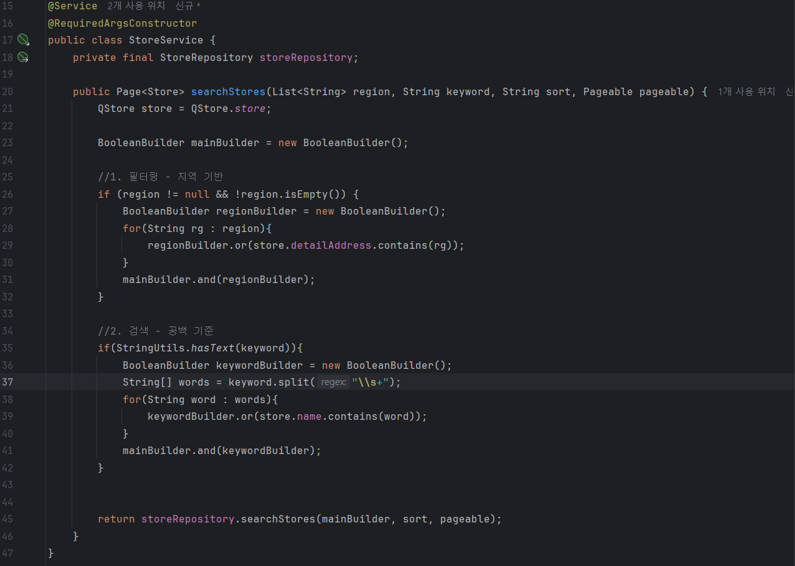
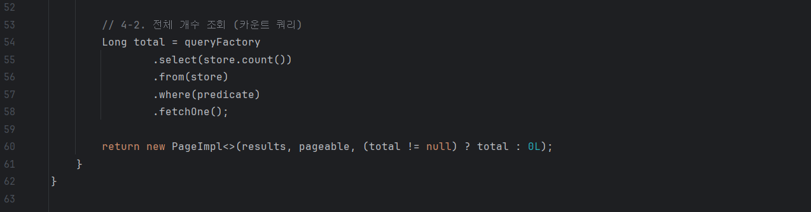

# 가게 검색 API 구현

# 전체코드

---

```java
@RestController
@RequiredArgsConstructor
public class StoreController {
    private final StoreService storeService;

    @GetMapping("/stores/search")
    public Page<Store> searchStore(@RequestParam List<String> region,
                                   @RequestParam String keyword,
                                   @RequestParam String sort, Pageable pageable) {
        //요청URL 예시: /stores/search?region=강남구&keyword=민트 초코&sort=name&page=0&size=10
        //다중검색: ?region=강남구&region=도봉구&region=영등포구
        return storeService.searchStores(region, keyword, sort, pageable);
    }
}
```

```java
@Service
@RequiredArgsConstructor
public class StoreService {
    private final StoreRepository storeRepository;

    public Page<Store> searchStores(List<String> region, String keyword, String sort, Pageable pageable) {
        QStore store = QStore.store;

        BooleanBuilder mainBuilder = new BooleanBuilder();

        //1. 필터링 - 지역 기반
        if (region != null && !region.isEmpty()) {
            BooleanBuilder regionBuilder = new BooleanBuilder();
            for(String rg : region){
                regionBuilder.or(store.detailAddress.contains(rg));
            }
            mainBuilder.and(regionBuilder);
        }

        //2. 검색 - 공백 기준
        if(StringUtils.hasText(keyword)){
            BooleanBuilder keywordBuilder = new BooleanBuilder();
            String[] words = keyword.split("\\s+");
            for(String word : words){
                keywordBuilder.or(store.name.contains(word));
            }
            mainBuilder.and(keywordBuilder);
        }

        return storeRepository.searchStores(mainBuilder, sort, pageable);
    }
}
```

```java
@Entity
@Builder
@NoArgsConstructor(access = AccessLevel.PROTECTED)
@AllArgsConstructor(access = AccessLevel.PRIVATE)
@Getter
@Table(name = "store")
public class Store extends BaseEntity {
    ...
    @Column(nullable = false)
    private String sortKey;

    @PrePersist @PreUpdate
    private void syncSortKey() {
        this.sortKey = buildSortKey(this.name);
    }
    public static String buildSortKey(String name) {
        if (name == null) return "";
        name = name.trim();

        StringBuilder sb = new StringBuilder(name.length() * 2);
        name.codePoints().forEach(cp -> {
            int bucket =
                    (cp >= 0xAC00 && cp <= 0xD7A3) ? 1 :                // 가~힣 (완성형)
                            (cp >= 'A' && cp <= 'Z') ? 2 :
                                    (cp >= 'a' && cp <= 'z') ? 3 : 4;
            sb.append((char) ('0' + bucket));
            // 소문자화(유니코드 안전)
            sb.append(new String(Character.toChars(Character.toLowerCase(cp))));
        });
        return sb.toString();
    }
    ...

}
```

```java
@Service
@RequiredArgsConstructor
public class StoreQueryDSLImpl implements StoreQueryDSL {

    private final EntityManager em;

    @Override
    public Page<Store> searchStores(Predicate predicate, String sort, Pageable pageable) {
        JPAQueryFactory queryFactory = new JPAQueryFactory(em);

        QStore store = QStore.store;

        //3. 정렬 - 최신순, 이름순
        OrderSpecifier<?>[] order;
        if("latest".equals(sort)){
            order = new OrderSpecifier[] {store.createdAt.desc()};
        }
        else if("name".equals(sort)){
            order = new OrderSpecifier[] {
                    store.sortKey.asc(),
                    store.createdAt.desc()
            };
        }
        else{
            order = new OrderSpecifier[]{}; //or Error Response
        }

        // 4-1. 데이터 목록 조회 (OFFSET 페이징)
        List<Store> results = queryFactory
                .selectFrom(store)
                .where(predicate)
                .orderBy(order)
                .offset(pageable.getOffset())
                .limit(pageable.getPageSize())
                .fetch();

        // 4-2. 전체 개수 조회 (카운트 쿼리)
        Long total = queryFactory
                .select(store.count())
                .from(store)
                .where(predicate)
                .fetchOne();

        return new PageImpl<>(results, pageable, (total != null) ? total : 0L);
    }
}
```

# 지역 기반 필터링

- 지역 기반 필터링
- 다중 선택 기능
- StoreService
    
    
    

## mainBuilder

---

```java
public Page<Store> searchStores(List<String> region, String keyword, String sort, Pageable pageable) {
    QStore store = QStore.store;

    BooleanBuilder mainBuilder = new BooleanBuilder();
    
    //1. 필터링 - 지역 기반
    ...  
    //2. 검색 - 공백 기준
    ...      

    return storeRepository.searchStores(mainBuilder, sort, pageable);
}
```

각 WHERE 조건을 개별로 생성하고, 이 WHERE 조건을 묶어 하나의 WHERE 절로 실행시키기 위한 mainBuilder.

예를 들어, region(지역)에서 필요한 WHERE 조건을 BuilderA로 묶고, keyword(검색어)에서 필요한 WHERE 조건들을 BuilderB로 묶는다.

mainBuilder에서 BuilderA와 BuilderB를 연결하여 하나의 WHERE절로 만든다.

```sql
... WHERE (... OR ... OR ... ) AND (... OR ... OR ...)
```

## 지역 기반 필터링 & 다중 선택

---

```java
public Page<Store> searchStores(List<String> region, String keyword, String sort, Pageable pageable) {
    QStore store = QStore.store;

    BooleanBuilder mainBuilder = new BooleanBuilder();

    //1. 필터링 - 지역 기반
    if (region != null && !region.isEmpty()) {
        BooleanBuilder regionBuilder = new BooleanBuilder();
        for(String rg : region){
            regionBuilder.or(store.detailAddress.contains(rg));
        }
        mainBuilder.and(regionBuilder);
    }
    
    //2. 검색 - 공백 기준
    ...

    return storeRepository.searchStores(mainBuilder, sort, pageable);
}
```

1.  `List<String> region`
    - 다중 검색을 위해 클라이언트에게 Query Parameter로 여러 개의 region을 받음
2. `BooleanBuilder regionBuilder = new BooleanBuilder();`
    - Region의 WHERE절을 만들기 위한 `regionBuilder`생성
3.  `regionBuilder.or(store.detailAddress.contains(rg));`
    - store의 **detailAddress(상세주소)**에 해당 **region(지역)**의 이름이 있는지 확인하고, 있다면 가져오는 조건을 `regionBuilder`에 `or`로 연결
4. `mainBuilder.and(regionBuilder);`
    - `mainBuilder`에 `regionBuilder`를 `and`로 연결

```sql
... WHERE store.detailAddress LIKE '%강남구%' OR store.detailAddress LIKE '%영등포구%' OR ...
```

# 가게 이름 검색

---

- **공백 포함 검색어**: 각 단어가 포함된 가게의 **합집합** 조회
    - 예: `'민트 초코'` → `'민트'` 포함 가게 + `'초코'` 포함 가게
- **공백 없는 검색어**: 검색어 전체가 포함된 가게만 조회
    - 예: `'민트초코'` → `'민트초코'` 포함 가게만 조회
- StoreService
    
    
    

```java
public Page<Store> searchStores(List<String> region, String keyword, String sort, Pageable pageable) {
    QStore store = QStore.store;

    BooleanBuilder mainBuilder = new BooleanBuilder();        
    
    //1. 필터링 - 지역 기반
    ...

    //2. 검색 - 공백 기준
    if(StringUtils.hasText(keyword)){
        BooleanBuilder keywordBuilder = new BooleanBuilder();
        String[] words = keyword.split("\\s+");
        for(String word : words){
            keywordBuilder.or(store.name.contains(word));
        }
        mainBuilder.and(keywordBuilder);
    }

    return storeRepository.searchStores(mainBuilder, sort, pageable);
}
```

`StringUtils.hasText(keyword)`

- 받은 검색어가 Text가 맞는지 확인. null이나 공백 문자열이면 false 반환

**로직**

- 검색어를 공백 기준으로 `split`하여 각 단어를 저장
- 각 단어를 기준으로 **store.name(가게이름)**이 해당 단어를 포함하는지 검사하는 조건을 생성

# 정렬

---

- `latest` : 최신순
- `name` : 이름순
    - 정렬 우선순위: **가나다 → 영어 대문자 → 영어 소문자 → 특수문자**
    - 이름이 동일한 경우: **최신순**으로 정렬
- StoreQueryDSLImpl
    
    
    
    
    

```java
@Override
public Page<Store> searchStores(Predicate predicate, String sort, Pageable pageable) {
  JPAQueryFactory queryFactory = new JPAQueryFactory(em);

  QStore store = QStore.store;

  //3. 정렬 - 최신순, 이름순
  OrderSpecifier<?>[] order;
  if("latest".equals(sort)){
      order = new OrderSpecifier[] {store.createdAt.desc()};
  }
  else if("name".equals(sort)){
      order = new OrderSpecifier[] {
              store.sortKey.asc(),
              store.createdAt.desc()
      };
  }
  else{
      order = new OrderSpecifier[]{}; //or Error Response
  }
  
  // 페이징 처리 없는 경우 (List 반환)
  return queryFactory
          .selectFrom(store)
          .where(predicate)
          .orderBy(order)
          .fetch();
          
   // 페이징 처리 있는 경우 (Pageable 반환, 아래 서술)
   ...
    return new PageImpl<>(...);
}
```

## **OrderSpecifier<?>**

---

정렬 조건 객체로, `store.createdAt.desc()` 와 같은 메서드가 반환하는 객체

- **`public** com.querydsl.core.types.**OrderSpecifier<T>** **desc()**`
- `queryFactory`의 `.orderBy()` 부분에 `OrderSpecifier<?>`객체를 사용함.
- 각 칼럼마다 타입이 다양하기 때문에 `<?>`(와일드카드) 사용
- 배열로 사용하면 여러 개의 정렬 조건 지정 가능

## 최신순(latest) 정렬

---

```java
...
OrderSpecifier<?>[] order;
if("latest".equals(sort)){
    order = new OrderSpecifier[] {store.createdAt.desc()};
}
...

return queryFactory
          .selectFrom(store)
          .where(predicate)
          .orderBy(order)
          .fetch();
```

`store.createdAt.desc()`

- store의 **createdAt(생성 시간)**을 기준으로 내림차순 정렬

## 이름순(name) 정렬

---

**조건**

- 정렬 우선순위: **가나다 → 영어 대문자 → 영어 소문자 → 특수문자**
- 이름이 동일한 경우: **최신순**으로 정렬

**가나다 → 영어 대문자 → 영어 소문자 → 특수문자**

정렬을 위해 Store 테이블에 정렬 전용 sortKey 칼럼을 생성한다.

sortKey 칼럼은 가게 이름의 각 글자 앞에 우선순위 숫자를 추가하여 만든 새로운 문자열을 저장한다.

- 우선순위
    - 한글 - 1
    - 영어 대문자 - 2
    - 영어 소문자 - 3
    - 그 외 - 4

예를 들어,

`store.name`이 **“가게이름”** 인 경우 `sortKey`에는 **“1가1게1이1름”** 이라는 데이터가 담기게 된다.

`store.name`이 **“가게name”** 인 경우 `sortKey`에는 **“1가1게3n3a3m3e”** 이라는 데이터가 담기게 된다.

```java
@Entity
@Builder
@NoArgsConstructor(access = AccessLevel.PROTECTED)
@AllArgsConstructor(access = AccessLevel.PRIVATE)
@Getter
@Table(name = "store")
public class Store extends BaseEntity {
    ...
    @Column(nullable = false)
    private String sortKey;

    @PrePersist @PreUpdate
    private void syncSortKey() {
        this.sortKey = buildSortKey(this.name);
    }
    public static String buildSortKey(String name) {
        if (name == null) return "";
        name = name.trim();

        StringBuilder sb = new StringBuilder(name.length() * 2);
        name.codePoints().forEach(cp -> {
            int bucket =
                    (cp >= 0xAC00 && cp <= 0xD7A3) ? 1 :                // 가~힣 (완성형)
                            (cp >= 'A' && cp <= 'Z') ? 2 :
                                    (cp >= 'a' && cp <= 'z') ? 3 : 4;
            sb.append((char) ('0' + bucket));
            // 소문자화(유니코드 안전)
            sb.append(new String(Character.toChars(Character.toLowerCase(cp))));
        });
        return sb.toString();
    }
    ...

}
```

저장된 sortKey 데이터를 기반으로 .asc() 오름차순 정렬을 수행한다.

이름이 같을 경우 최신순 정렬을 수행한다.

```java
@Override
public Page<Store> searchStores(Predicate predicate, String sort, Pageable pageable) {
  ...
  else if("name".equals(sort)){
      order = new OrderSpecifier[] {
              store.sortKey.asc(),
              store.createdAt.desc()
      };
  }
  ...
  
  return queryFactory
          .selectFrom(store)
          .where(predicate)
          .orderBy(order)
          .fetch();
}
```

# 페이징

---

- 기본 페이징: `page` + `size`
- StoreQueryDSLImpl
    
    
    
    
    

## 기본 페이징 (OFFSET)

```java
@GetMapping("/stores/search")
public Page<Store> searchStore(@RequestParam List<String> region,
                               @RequestParam String keyword,
                               @RequestParam String sort, Pageable pageable) {
    //요청URL 예시: /stores/search?region=강남구&keyword=민트 초코&sort=name&page=0&size=10
    //다중검색: ?region=강남구&region=도봉구&region=영등포구
    return storeService.searchStores(region, keyword, sort, pageable);
}
```

```java
@Override
public Page<Store> searchStores(Predicate predicate, String sort, Pageable pageable) {
    JPAQueryFactory queryFactory = new JPAQueryFactory(em);

    QStore store = QStore.store;

    //3. 정렬 - 최신순, 이름순
    OrderSpecifier<?>[] order;
    ...

    // 4-1. 데이터 목록 조회 (OFFSET 페이징)
    List<Store> results = queryFactory
            .selectFrom(store)
            .where(predicate)
            .orderBy(order)
            .offset(pageable.getOffset())
            .limit(pageable.getPageSize())
            .fetch();

    // 4-2. 전체 개수 조회 (카운트 쿼리)
    Long total = queryFactory
            .select(store.count())
            .from(store)
            .where(predicate)
            .fetchOne();

    return new PageImpl<>(results, pageable, (total != null) ? total : 0L);
}
```

**로직**

1. 클라이언트에게 Query Parameter로 page와 size를 받아서 `Pageable`객체로 가져옴
2. `queryFactory`에서 `.offset()`과 `.limit()`로 페이징 처리 수행
3. 전체 데이터 개수 데이터인 `countQuery`를 생성
4. `Page<>` 객체를 반환 
    - (`return new PageImpl<>(results, pageable, (total != null) ? total : 0L);`)

# 트러블슈팅

---

이름 순 정렬을 구현하면서

- 정렬 우선순위: **가나다 → 영어 대문자 → 영어 소문자 → 특수문자**

해당 조건을 만족하기 위해 DB의 orderby 정렬을 커스텀 하는 방향으로 진행했었다.

```java
else if("name".equals(sort)){
    NumberExpression<Integer> namePriority = new CaseBuilder()
            .when(store.name.substring(0, 1).between("가", "힣")).then(1)    // 한글
            .when(store.name.substring(0, 1).between("A", "Z")).then(2)    // 영어 대문자
            .when(store.name.substring(0, 1).between("a", "z")).then(3)    // 영어 소문자
            .otherwise(4);

    order = new OrderSpecifier[] {
            namePriority.asc(),
            store.name.asc(),
            store.createdAt.desc()
    };
}
```

첫 글자를 기준으로 한글/영어/숫자 및 특수문자 그룹화하고, 우선순위를 부여하여 정렬하는 방향으로 구현했었다.

하지만, 정렬이 제대로 안되는 이슈가 발생했다.

## 문제 1

**“가게” → “Store” → “store” → “1번가게”**

와 같은 순수 한글, 순수 영어 데이터는 올바르게 정렬이 됐지만,

그룹 내부에서는 `store.name.asc()` 정렬을 수행하기에

한글과 영어가 복합되어 있는 경우 **“가게name” → “가게이름”** 순서로 정렬이 되는 문제가 발생했다.

## 문제 2

DB에서 영어 대소문자 구별을 못함.

이를 위해 아스키코드 값으로 비교하는 등 추가적인 코드가 필요했음.

## 문제 3

정렬 방식을 동적으로 생성한 것이어서 커서 기반 페이징 구현이 복잡해짐.

## 시도 1

```java
else if("name".equals(sort)){
    order = new OrderSpecifier[] {
            Expressions.stringTemplate("BINARY({0})", store.name).desc(),
            store.createdAt.desc()
    };
}
```

가게이름 내림차순 정렬 + 대소문자 구분하도록 `BINARY()` 적용

`BINARY(store.name)`을 적용해 대소문자 구분을 하도록 만들고 내림차순 정렬을 진행

다만, 이 경우 

**한글 → 영어 소문자 → 영어 대문자 → 숫자 및 특수문자** 순서로 정렬이 진행되어 미션의 조건인 

**한글 → 영어 대문자 → 영어 소문자 → 숫자 및 특수문자** 서로는 정렬이 안됨.

또한 이름이 내림차순 정렬이라 **ㅎ → ㄱ, Z → A** 순서로 정렬되는 것이 문제

## 시도 2

```java
else if("name".equals(sort)){
    StringExpression firstCharBinary = Expressions.stringTemplate("BINARY({0})", store.name.substring(0, 1));

    NumberExpression<Integer> namePriority = new CaseBuilder()
            .when(store.name.substring(0, 1).between("가", "힣")).then(1)    // 한글
            .when(firstCharBinary.between("A", "Z")).then(2)    // 영어 대문자
            .when(firstCharBinary.between("a", "z")).then(3)    // 영어 소문자
            .otherwise(4);

    order = new OrderSpecifier[] {
            namePriority.asc(),
            Expressions.stringTemplate("BINARY({0})", store.name).asc(),
            store.createdAt.desc()
    };
}
```

한글 → 영어 대문자 → 영어 소문자 → 특수문자 그룹화는 유지하고 `BINARY()` 로 영어 대소문자 구분만 수행

### BINARY()

영어 대소문자 구분하기 위해 DB에서 문자열을  **byte** 기준으로 비교하게 한다.

### CaseBuilder

SQL의 `CASE WHEN ... THEN ... END` 구문을 QueryDSL로 작성하게 돕는 클래스

`.when()` 조건에 따라 우선순위(`.then(1)`, `.then(2)`, `.then(3)` 등)가 매겨진다.

### 다중 조건 정렬

정렬 조건을 여러 개 지정하여 순서대로 정렬을 수행한다.

1. 가게 이름의 첫 글자를 기준으로 **한글 → 영어 대문자 → 영어 소문자 → 특수문자 및 숫자** 순서대로 그룹을 만들고, 그룹 별로 정렬
    
    
    | store.name | namePriority |
    | --- | --- |
    | 가게1 | 1 |
    | 가게2 | 1 |
    | A가게 | 2 |
    | a가게  | 3 |
    | !가게 | 4 |
2. 그룹 내부에서 영어 대소문자 구분하여 가게 이름 오름차순 정렬
3. 최신 순 정렬

정렬 조건에서 비교 대상이 동일하다면, 다음 정렬로 넘어가는 방식이다.

예를 들어, 정렬 조건 2번에서 가게 이름이 동일하다면 정렬 조건 3번으로 넘어가 최신 순으로 정렬을 진행한다.

하지만,

**“가게name” → “가게이름”** 순서로 정렬되는 문제는 여전했다.

## 해결

[이름순(name) 정렬](https://www.notion.so/name-29db57f4596b803480d2cae38585a151?pvs=21) 

**문제 1:** 한글-영어 복합어 문제

- 문자열의 각 문자를 비교하여 정렬함으로써 해결

**문제 2:** 대소문자 구분 문제

- 우선순위를 어플리케이션 영역에서 지정하여 부여함으로써 해결

**문제 3:** 커서 기반 페이징 문제

- sortKey 칼럼을 기준으로 정렬을 수행하기에 구현 간단해짐.

문제를 완전히 해결하지 못한 채 [시도 2](https://www.notion.so/2-29fb57f4596b80f098d1deccd34b5b8d?pvs=21) 까지 하고 스터디를 진행했다.

스터디를 진행하며 팀원들에게 문제를 공유했고, 여러 아이디어와 의논 끝에 해결책을 얻을 수 있었다.