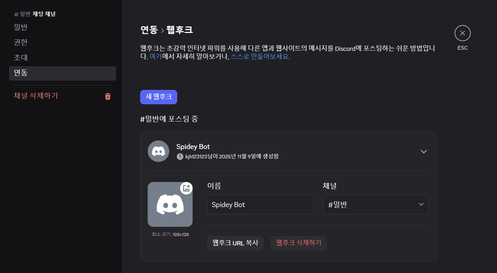
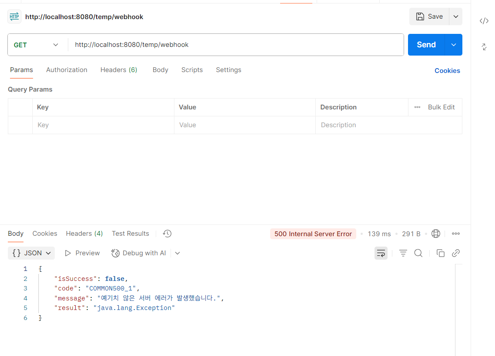
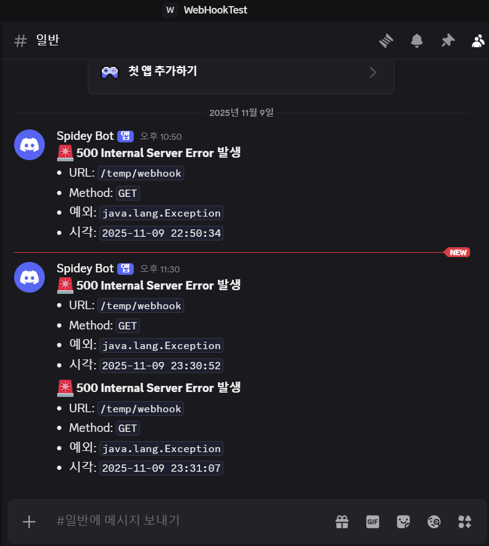
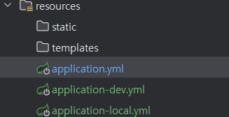
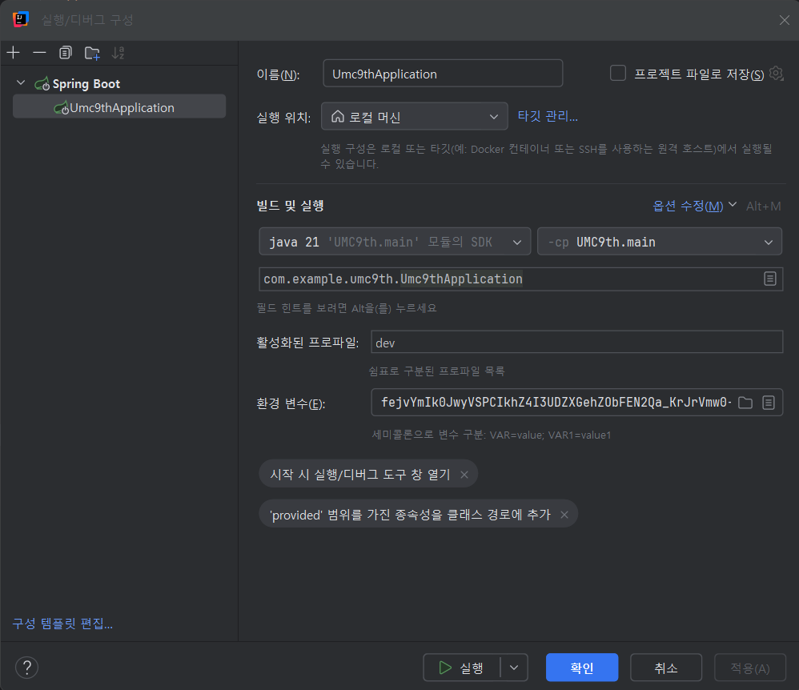

# 에러 발생 시 디스코드 자동  알림 설정

# **디스코드 웹훅(Webhook) 설정**

---

- 디스코드 혹은 슬랙에서 **Webhook URL 생성**.



# **예외 핸들러를 통해 500 에러 감지**

---

- `@ControllerAdvice` 500에러를 탐지하는 곳에 discord나 슬랙에 보내는 코드를 작성
- 발생한 예외 메시지, 요청 URL, 발생 시각 등의 정보를 포함한 **에러 로그 포맷 정의**.
- **디스코드**나 **슬랙**에 **POST 요청**을 보내는 **코드 작성** (이때 Webhook URL이 유출되지 않게금 주의한다.)

`RestTemplate`을 사용하여 500에러 발생 시  **디스코드 WebhookURL**에 **POST 요청**을 보낸다.

```java
package com.example.umc9th.global.service;

import lombok.RequiredArgsConstructor;
import lombok.extern.slf4j.Slf4j;
import org.springframework.beans.factory.annotation.Value;
import org.springframework.http.HttpEntity;
import org.springframework.http.HttpHeaders;
import org.springframework.http.MediaType;
import org.springframework.stereotype.Service;
import org.springframework.web.client.RestTemplate;

import java.time.LocalDateTime;
import java.time.format.DateTimeFormatter;
import java.util.Map;

@Service
@RequiredArgsConstructor
@Slf4j
public class DiscordWebhookService {
    //Webhook URL을 환경변수에 저장
    @Value("${alert.discord.webhook-url}")
    private String webhookUrl;

    //local환경이면 enabled:false, dev환경이면 enabled:true
    @Value("${alert.discord.enabled}")
    private boolean webhookEnabled;

    //Spring Framework에서 제공하는 동기(Synchronous) 방식의 HTTP 클라이언트
    //다른 서버의 API를 호출할 때 사용
    private final RestTemplate restTemplate = new RestTemplate();

    public void sendErrorToWebhook(Exception ex, String url, String method) {
        try {
            if(webhookEnabled){
                String message = buildMessage(ex, url, method);

                //HTTP Header 정의, Content-Type: application/json
                HttpHeaders headers = new HttpHeaders();
                headers.setContentType(MediaType.APPLICATION_JSON);

                // Discord body 형식({content: 내용})
                Map<String, String> payload = Map.of("content", message);

                //header + body
                HttpEntity<Map<String, String>> entity = new HttpEntity<>(payload, headers);

                //webhookUrl에 entity내용을 post로 전송
                restTemplate.postForEntity(webhookUrl, entity, String.class);
            }

        } catch (Exception e) {
            log.error("Failed to send webhook: {}", e.getMessage());
        }
    }

    // Discord에 보낼 메시지 형식
    private String buildMessage(Exception ex, String url, String method) {
        return """
                🚨 **500 Internal Server Error 발생**
                - URL: `%s`
                - Method: `%s`
                - 예외: `%s`
                - 시각: `%s`
                """.formatted(
                url,
                method,
                ex.getMessage(),
                LocalDateTime.now().format(DateTimeFormatter.ofPattern("yyyy-MM-dd HH:mm:ss"))
        );
    }

}

```

```java
package com.example.umc9th.global.apiPayload.handler;

import com.example.umc9th.global.apiPayload.ApiResponse;
import com.example.umc9th.global.apiPayload.code.BaseErrorCode;
import com.example.umc9th.global.apiPayload.code.GeneralErrorCode;
import com.example.umc9th.global.apiPayload.exception.GeneralException;
import com.example.umc9th.global.service.DiscordWebhookService;
import jakarta.servlet.http.HttpServletRequest;
import lombok.RequiredArgsConstructor;
import lombok.extern.slf4j.Slf4j;
import org.springframework.http.ResponseEntity;
import org.springframework.web.bind.annotation.ExceptionHandler;
import org.springframework.web.bind.annotation.RestControllerAdvice;

@RestControllerAdvice
@RequiredArgsConstructor
@Slf4j
public class GeneralExceptionAdvice {

    private final DiscordWebhookService discordWebhookService;
    
    ...

    // 그 외의 정의되지 않은 모든 예외 처리
    @ExceptionHandler(Exception.class)
    public ResponseEntity<ApiResponse<String>> handleException(Exception ex, HttpServletRequest request){

				// 오류난 url과 httpMethod 가져오기
        String url = request.getRequestURI();
        String method = request.getMethod();

        // 로그 출력
        log.error("[500 ERROR] {} {} - {}", method, url, ex.getMessage(), ex);

        // 웹훅으로 전송
        discordWebhookService.sendErrorToWebhook(ex, url, method);

        BaseErrorCode code = GeneralErrorCode.INTERNAL_SERVER_ERROR;
        return ResponseEntity.status(code.getStatus())
                .body(ApiResponse.onFailure(code, ex.getMessage()));
    }

}

```

```yaml
spring:
  application:
    name: "UMC9th" # "umc9th"

...

alert:
  discord:
    webhook-url: ${DISCORD_WEBHOOK_URL}
    enabled: false
```


환경 변수에 Webhook URL 추가

Webhook URL가 유출되지 않게 하기 위해 환경 변수에 저장하고 application.yml에서 사용한다.

# **에러 발생 시 알림 테스트**

---

- 강제로 500 에러를 발생시키는 API 엔드포인트를 구현하고 **정상적으로 알림이 전송되는지 테스트**.

```java
package com.example.umc9th.domain.test.controller;

@RestController
@RequiredArgsConstructor
@RequestMapping("/temp")
public class TestController {
		
		...

    @GetMapping("/webhook")
    public ApiResponse<TestResDTO.Testing> webhookTest(){
        try{
            throw new Exception();
        } catch (Exception e) {
            throw new RuntimeException(e);
        }
    }
}

```



Postman



Discord

# **개발 서버, 로컬 서버** 알림 분리

- **개발 서버(or 운영 서버) 환경**에서만 알림이 오도록 **설정**
    - 만약 로컬 서버에서 난 에러도 알림이 가게 한다면 팀 협업 시 어떠한 일이 일어날 지 생각 해본다.

```yaml
spring:
  application:
    name: "UMC9th" # "umc9th"

  datasource:
    driver-class-name: com.mysql.cj.jdbc.Driver # MySQL JDBC ???? ??? ??
    url: ${DB_URL} # jdbc:mysql://localhost:3306/{???????}
    username: ${DB_USER} # MySQL ?? ??
    password: ${DB_PW} # MySQL ????

  jpa:
    database: mysql # ??? ?????? ?? ?? (MySQL)
    database-platform: org.hibernate.dialect.MySQLDialect # Hibernate?? ??? MySQL ??(dialect) ??
    show-sql: true # ??? SQL ??? ??? ???? ?? ??
    hibernate:
      ddl-auto: update # ?????? ?? ? ?????? ???? ??? ??
    properties:
      hibernate:
        format_sql: true # ???? SQL ??? ?? ?? ???

alert:
  discord:
    webhook-url: ${DISCORD_WEBHOOK_URL}
    enabled: false
```

```yaml
alert:
  discord:
    enabled: true
```

```yaml
alert:
  discord:
    enabled: false
```

로컬환경과 개발환경을 구분하기 위해 기존의 `application.yml`에 더해 `application-dev.yml`, `application-local.yml` 파일을 추가한다.



application-{profile}.yml



활성화된 프로파일(Active Profiles): dev

SpringBoot에서는 `application-{profile}.yml` 형식으로 **profile**을 구분할 수 있다.

구성에서 **현재 profile을 dev로 설정**한다면, 기존 `appllication.yml`과 `application-dev.yml` 두 파일을 **인식**한다.

- 만약 `application.yml`과 `application-dev.ym`l에 같은 설정이 있다면 `application-dev.yml`의 설정을 사용한다 (**덮어쓰기**)

```java
package com.example.umc9th.global.service;

@Service
@RequiredArgsConstructor
@Slf4j
public class DiscordWebhookService {
    //Webhook URL을 환경변수에 저장
    @Value("${alert.discord.webhook-url}")
    private String webhookUrl;

    //local환경이면 enabled:false, dev환경이면 enabled:true
    @Value("${alert.discord.enabled}")
    private boolean webhookEnabled;

    //Spring Framework에서 제공하는 동기(Synchronous) 방식의 HTTP 클라이언트
    //다른 서버의 API를 호출할 때 사용
    private final RestTemplate restTemplate = new RestTemplate();

    public void sendErrorToWebhook(Exception ex, String url, String method) {
        try {
            if(webhookEnabled){
                String message = buildMessage(ex, url, method);

                //HTTP Header 정의, Content-Type: application/json
                HttpHeaders headers = new HttpHeaders();
                headers.setContentType(MediaType.APPLICATION_JSON);

                // Discord body 형식({content: 내용})
                Map<String, String> payload = Map.of("content", message);

                //header + body
                HttpEntity<Map<String, String>> entity = new HttpEntity<>(payload, headers);

                //webhookUrl에 entity내용을 post로 전송
                restTemplate.postForEntity(webhookUrl, entity, String.class);
            }

        } catch (Exception e) {
            log.error("Failed to send webhook: {}", e.getMessage());
        }
    }

    // Discord에 보낼 메시지 형식
    private String buildMessage(Exception ex, String url, String method) {
        return """
                🚨 **500 Internal Server Error 발생**
                - URL: `%s`
                - Method: `%s`
                - 예외: `%s`
                - 시각: `%s`
                """.formatted(
                url,
                method,
                ex.getMessage(),
                LocalDateTime.now().format(DateTimeFormatter.ofPattern("yyyy-MM-dd HH:mm:ss"))
        );
    }

}

```

dev 환경 (enabled: true)에서만 webhook이 작동되도록 설정한다.

개발 과정에서 에러는 빈번하게 일어난다.

로컬 서버에서 에러가 발생할 때 마다 알람이 발생한다면, 수많은 불필요한 알람이 발생해 알람의 중요도를 낮게 인식할 수 있다.