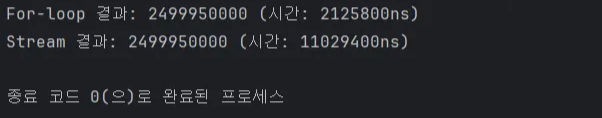

# Page와 Slice, For와 Stream

# Page와 Slice

---

## 출력값 비교

```json
{
  "content": [ ... 데이터 리스트 ... ],
  "pageable": { ... },
  "last": false,
  "totalPages": 10,  
  "totalElements": 100,
  "size": 10,
  "number": 0,
  "first": true,
  "numberOfElements": 10,
  "empty": false
}
```

```json
{
  "content": [ ... 데이터 리스트 ... ],
  "pageable": { ... },
  "last": false,
  "size": 10,
  "number": 0,
  "first": true,
  "numberOfElements": 10,
  "hasNext": true,
  "empty": false
}
```

Page는 `totalPages`(전체 페이지 수), `totalElements`(전체 데이터 수)를 출력하고,

Slice는 `hasNext`(다음 페이지 여부)를 출력한다.

## 장단점 비교

### Page

**장점**

- 전체 데이터 양 파악 가능
- 특정 페이지로 바로 이동 가능

**단점**

- 데이터가 많아질수록 전체 데이터 개수를 계산하는 COUNT 쿼리 성능이 안좋아짐

### Slice

**장점**

- 전체 데이터 개수를 계산하는 COUNT 쿼리가 실행되지 않아 성능이 더 좋음

**단점**

- 전체 데이터 개수를 알 수 없음
- OFFSET 방식으로 구현할 경우 데이터가 많아지면 성능 하락
- 특정 페이지로 바로 이동하는 기능 구현이 어려움

## 언제 적용해야 할까?

### Page

- 사용자가 데이터의 전체 양을 알아야 하거나, 특정 위치로 건너뛰는 기능이 필요할 경우

### Slice

- 무한 스크롤 처럼 데이터의 끝보다는 끊김 없는 탐색 경험이 중요할 경우

# For와 Stream

---

## 수행 시간 테스트

```java
import java.util.ArrayList;
import java.util.List;

public class Main {
    public static void main(String[] args) {

        List<Integer> numbers = new ArrayList<>();
        for (int i = 0; i < 100_000; i++) {
            numbers.add(i);
        }

        // 1. For-loop
        long startTime = System.nanoTime();
        long sumFor = 0;
        for (Integer num : numbers) {
            if (num % 2 == 0) {
                sumFor += num;
            }
        }
        long endTime = System.nanoTime();
        System.out.println("For-loop 결과: " + sumFor + " (시간: " + (endTime - startTime) + "ns)");

        // 2. Stream
        startTime = System.nanoTime();
        long sumStream = numbers.stream()
                .filter(num -> num % 2 == 0) // 짝수 필터링
                .mapToLong(Integer::longValue) // Unboxing 및 Long 변환
                .sum(); // 합계
        endTime = System.nanoTime();
        System.out.println("Stream 결과: " + sumStream + " (시간: " + (endTime - startTime) + "ns)");
    }
}
```



결과

### 결론

단순한 연산(단순 덧셈 등)과 원시 자료형 처리에서는 For가 Stream 보다 훨씬 빠르다.

Stream은 내부적으로 객체 생성, 람다 표현식 처리, 파이프라인 구성 등의 오버헤드가 발생하기 때문이다.

하지만 로직이 복잡해질수록 성능 차이는 미미해지거나, 병렬 처리 시 Stream이 유리해질 수 있다.

## 장단점 비교

## For

**장점**

- 중단점을 통한 디버깅에 용이함
- 초기 오버헤드가 없음
- break, continue, return으로 제어 흐름 조작 가능

**단점**

- 로직이 복잡해지면 가독성이 떨어질 수 있음

## Stream

**장점**

- 가독성이 좋아 로직의 흐름이 한눈에 들어옴
- 로직이 복잡한 경우 성능이 향상됨

**단점**

- 한 번에 연결 실행되므로 디버깅과 제어 흐름 조작이 어려울 수 있음
- 단순 반복에서는 성능이 느림

## 언제 적용하면 좋을까?

### For

- 반복 횟수가 극도로 많아 성능이 최우선일 때
- `break`, `continue` 등을 이용해 세밀하게 반복을 제어해야 하거나, 인덱스(`i`)를 직접 다뤄야 할 때
- 원시 타입(int, long) 위주의 단순 연산 할 때

### Stream

- 데이터 처리 로직이 복잡할 때 코드가 간결해진다.
- 가독성과 유지보수가 중요할 때